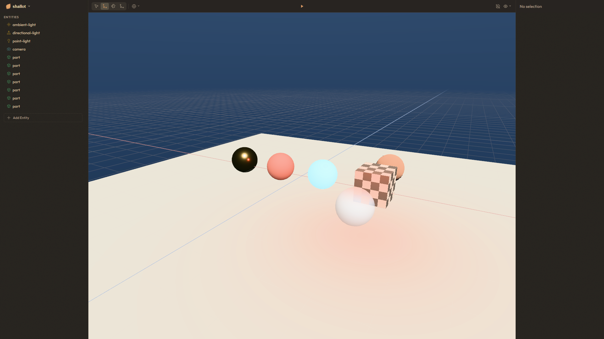

# Shallot

webgpu game engine

- fast by default
- instant iteration
- runs anywhere



## quick start

All you need is [bun](https://bun.sh):

```bash
bun create shallot my-game
cd my-game
bun install
bunx shallot
```

`bunx shallot` opens the project in the editor: edit the scene, add entities and components, press play. `bunx shallot dev` runs it standalone with hot reload, and `bunx shallot build` ships it — web by default, or `--target windows|mac|linux` for native.

The project is plain data: a `shallot.json` manifest, a scene file, and TypeScript plugins you edit in your IDE. The editor reads and writes the same files.

The [docs](https://dylanebert.github.io/shallot/docs) start with the quick start guide, then walk through making a game end to end.

## links

- [docs](https://dylanebert.github.io/shallot/docs)
- [discord](https://discord.gg/eEY75Nqk3C)
- [npm](https://www.npmjs.com/package/@dylanebert/shallot)

## examples

Examples are grouped by audience under `examples/`: `templates/` (the `starter` onboarding scaffold), `zoo/` (one-concept teaching specimens), `showcase/` (visual exhibits — `collapse`, `sandbox`, `fountain`, `voxel`, `visualization`), and `gym/` (machine-verdict scenarios). Every example is a minimal manifest project run through the CLI, except `gym` and `showcase/visualization`, which own a vite harness:

```bash
bunx shallot dev examples/zoo/orbit    # run a specimen standalone
bunx shallot examples/zoo/orbit        # open it in the editor
```

## from source

Working on the engine itself needs the full toolchain:

- [bun](https://bun.sh)
- [rust](https://rustup.rs) with the `wasm32-unknown-unknown` target (`rustup target add wasm32-unknown-unknown`)
- [wasm-pack](https://github.com/wasm-bindgen/wasm-pack)
- `wasm-opt` from [binaryen](https://github.com/WebAssembly/binaryen) — optional, build falls back to a copy

```bash
git clone https://github.com/dylanebert/shallot
cd shallot
bun install
bun run build
```

`build` compiles the rust crates (transforms wasm, audio wasm, native window host) and the docs site.

### layout

- `packages/shallot/` — the engine. published as `@dylanebert/shallot`
- `packages/shallot/editor/` — Svelte editor app
- `packages/create-shallot/` — `bun create shallot` scaffold
- `packages/vscode-shallot/` — VS Code extension
- `examples/` — example projects against the engine
- `docs/` — guide, engine, standard, extras, editor. Reference tables generated from JSDoc by `bun run build`

### commands

run from the repo root.

```bash
bun test           # unit tests (bun-webgpu)
bun bench          # gpu benchmarks
bun check          # format + type check
bun run format     # biome + scene formatter
bun run build      # rust artifacts + docs
```

`bun check` and `bun test` should pass before pushing. `bun bench` after gpu changes.

Issues are open; pull requests are by invitation — see [CONTRIBUTING.md](CONTRIBUTING.md).

## license

MIT
